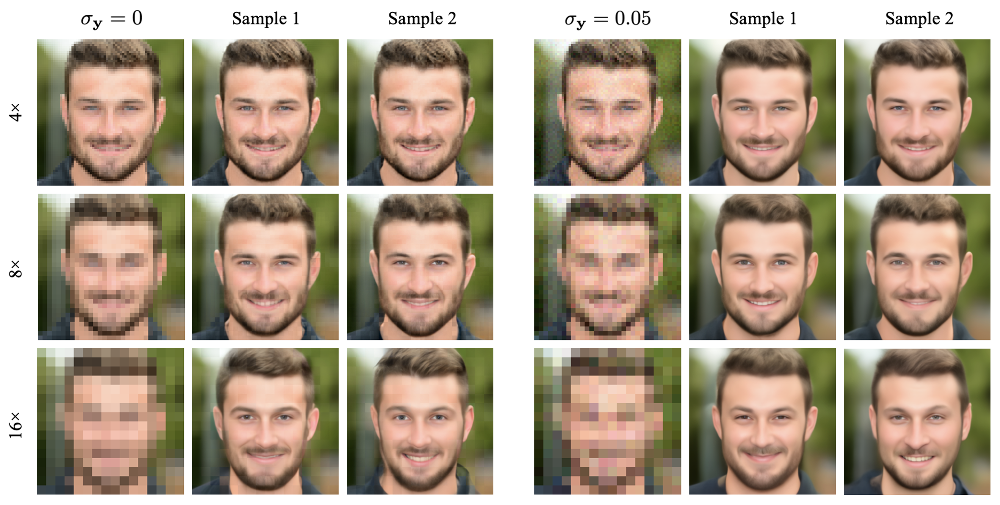
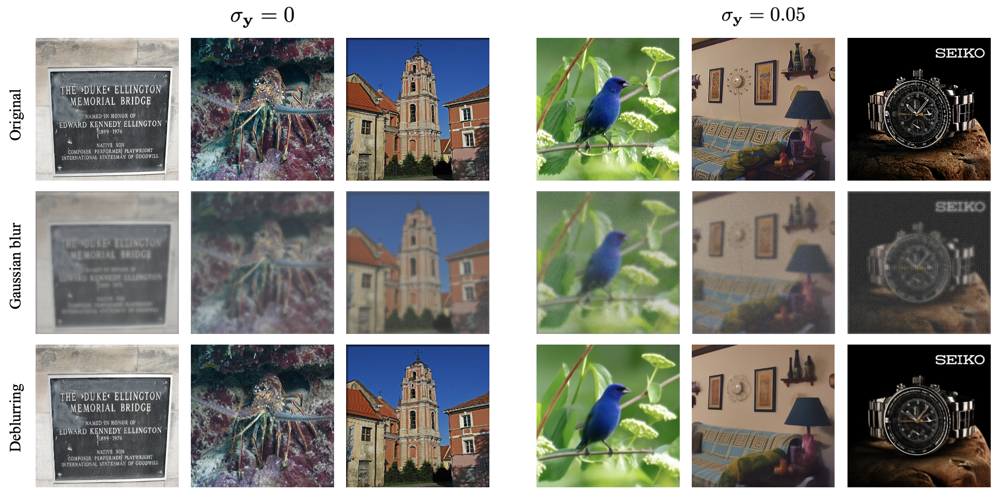
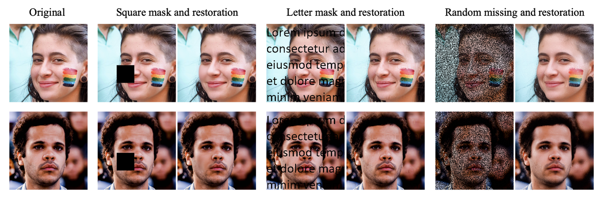

# Reimplementation-DDRM
Reimplementation of DDRM based on NeurIPS 2022 paper “Denoising Diffusion Restoration Models”.

```bibtex
@inproceedings{kawar2022denoising,
    title={Denoising Diffusion Restoration Models},
    author={Bahjat Kawar and Michael Elad and Stefano Ermon and Jiaming Song},
    booktitle={Advances in Neural Information Processing Systems},
    year={2022}
}
```

### Environment Setting
```bash
pip install -r requirements.txt
```

### Model Download
Download models in model_zoo folder by:
```bash
bash download.sh
```

### Running
```python
# set hyperparameters internally
python main_sr.py
python main_deblur.py
python main_inpaint.py
```

### Results
<p align="center">
  
  <em>Figure 1. Super-resolution restoration results.</em>
</p>

<p align="center">
  
  <em>Figure 2. Deblurring results on ImageNet images.</em>
</p>

<p align="center">
  
  <em>Figure 3. Inpainting results on FFHQ face images.</em>
</p>

For more quantitative results, please check out our [project report](ProjectReport-Group12.pdf).